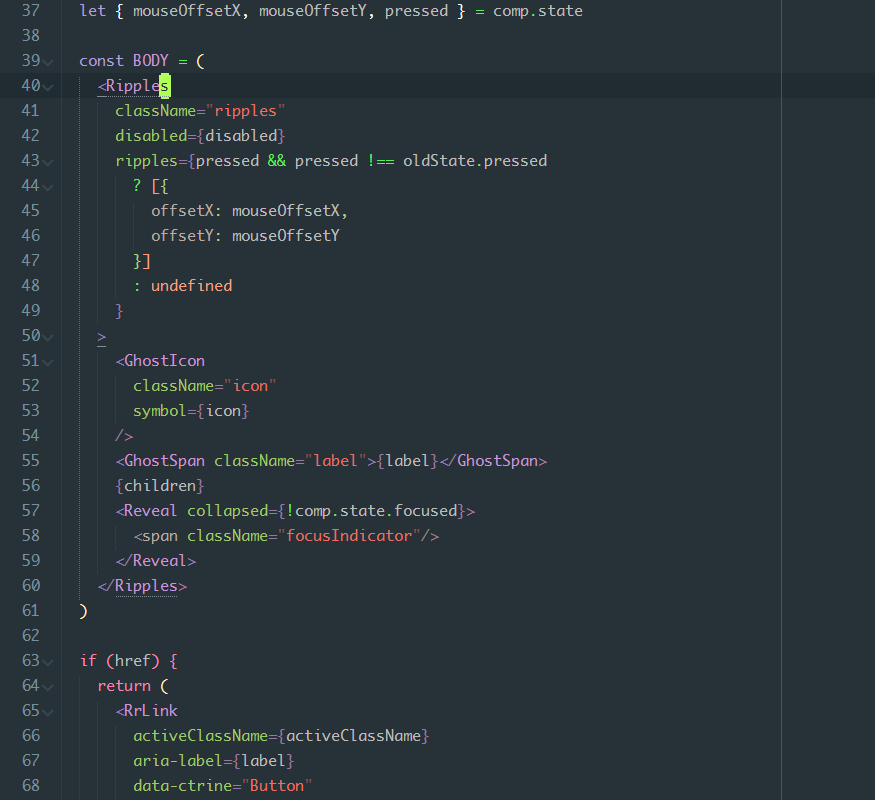

[][naomi]

[][sublime]
[][naomi]
[][package-control]
[][stars]
[][forks]

## Installation

#### Manual installation

Clone the repository in your Sublime Text “Packages” directory:

    git clone https://github.com/borela/naomi.git Naomi

The “Packages” directory is located at:

* **OS X**: `~/Library/Application Support/Sublime Text 3/Packages`
* **Linux**: `~/.config/sublime-text-3/Packages`
* **Windows**: `%APPDATA%\Sublime Text 3\Packages`

#### Installing using Package Control

1. Install [Package Control](https://packagecontrol.io/installation).
2. Run **Package Control: Install Package** command.
3. Find and install the **Naomi** plugin.
4. Restart Sublime Text if there are issues.

## Usage

Go to the menu `View / Syntax / Naomi / ...` to select the new syntax.

### Sublime Linter

To enable [Sublime Linter][sublimeLinter] with the syntaxes available, you need to:

1. Go to the menu `Preferences / Package Settings / SublimeLinter / Settings - User `.
2. Add these entries to the `syntax_map`:

```JSON
{
  "syntax_map": {
    "naomi.fjsx15": "javascript",
    "naomi.html5": "html",
    "naomi.mql4": "mql",
    "naomi.php7": "php",
    "naomi.scss3": "scss"
  }
}
```

## Features

#### General

* Auto complete asterisks in documentation blocks.
* Add Mac’s curly quotes shortcuts for Windows and Linux:
  1. Alt+[ produces “.
  2. Alt+Shift+[ produces ”.
  3. Alt+] produces ‘.
  4. Alt+Shift+] produces ’.
* Stable syntaxes:
  * FJSX15 (Combines ES2015+, Flow, React’s JSX).
  * HTML 5.
  * SCSS3.
  * MQL4.
  * PHP 7.

## Preview

#### FJSX15 (ES2015 + FlowType + React’s JSX)




[candyman]: schemes/candyman
[package-control]: //packagecontrol.io/packages/Naomi
[csscheme]: //github.com/FichteFoll/CSScheme
[design]: DESIGN.md
[sublime]: //www.sublimetext.com
[naomi]: //github.com/borela/naomi
[stars]: //github.com/borela/naomi/stargazers
[forks]: //github.com/borela/naomi/network/members
[sublimeLinter]: //github.com/SublimeLinter/SublimeLinter3
