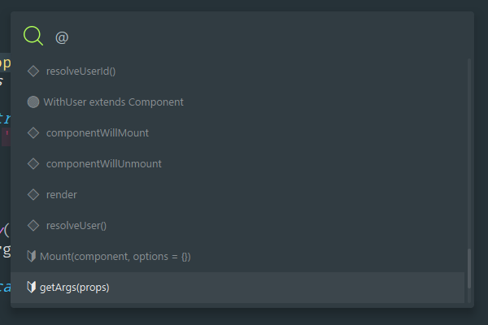
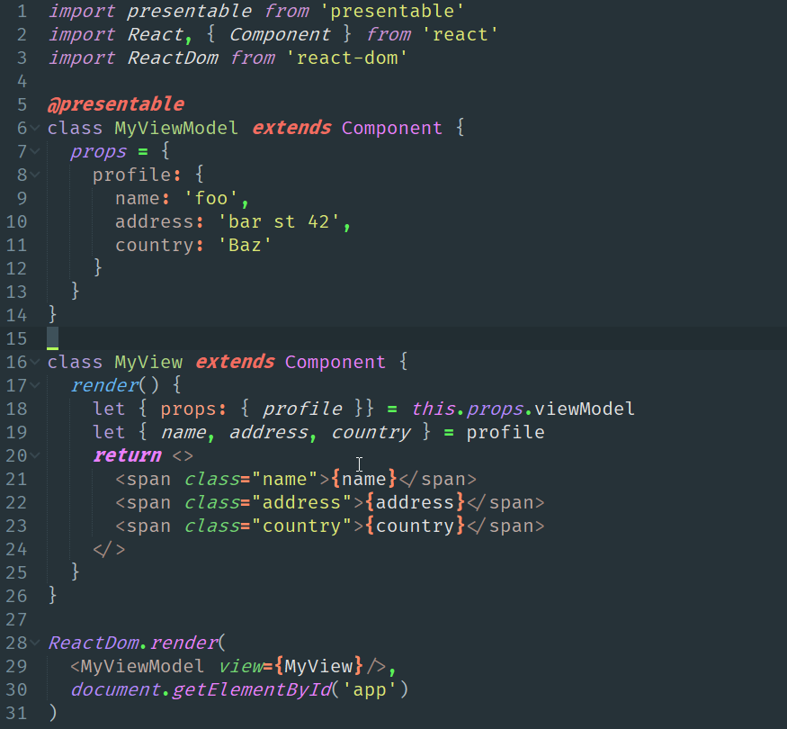

[][naomi]

[][watchers]
[][stars]
[][issues]
[][pulls]
[][forks]

[][naomi]
[][sublime]
[][naomi]
[][naomi]
[][package-control]

## Installation

#### Manual installation

Clone the repository in your Sublime Text “Packages” directory:

    git clone https://github.com/borela/naomi.git Naomi

The “Packages” directory is located at:

* **OS X**: `~/Library/Application Support/Sublime Text 3/Packages`
* **Linux**: `~/.config/sublime-text-3/Packages`
* **Windows**: `%APPDATA%\Sublime Text 3\Packages`

#### Installing using Package Control

1. Install [Package Control](https://packagecontrol.io/installation).
2. Run **Package Control: Install Package** command.
3. Find and install the **Naomi** plugin.
4. Restart Sublime Text if there are issues.

## Usage

Go to the menu `View / Syntax / Naomi / ...` to select the new syntax.

### Sublime Linter

To enable [Sublime Linter][sublimeLinter] with the syntaxes available, you need to:

1. Go to the menu `Preferences / Package Settings / SublimeLinter / Settings - User `.
2. Add these entries to the `syntax_map`:

```JSON
{
  "syntax_map": {
    "naomi.fjsx15": "javascript",
    "naomi.html5": "html",
    "naomi.mql4": "mql",
    "naomi.php7": "php",
    "naomi.scss3": "scss"
  }
}
```

## Features

### Syntaxes:

* FJSX15 (Combines ES2015+, Flow, React’s JSX).
* HTML 5.
* SCSS3.
* MQL4.
* PHP 7.

### Enhanced go to symbol



### Docblock shortcuts

* `Enter` creates a new comment line.
* `Backspace` deletes the current line and goes to the previous one.
* `Shift+Enter` closes the docblock.
  

### Single line comment shortcuts

* `Shift+Enter` creates new single line comment.
* `Backspace` deletes the current line and goes to the previous one.
  

### Mac’s curly quotes for windows and Linux

* `Alt+[` produces “.
* `Alt+Shift+[` produces ”.
* `Alt+]` produces ‘.
* `Alt+Shift+]` produces ’.

## Preview

#### FJSX15 (ES2015 + FlowType + React’s JSX)



[candyman]: schemes/candyman
[package-control]: //packagecontrol.io/packages/Naomi
[sublime]: //www.sublimetext.com
[naomi]: //github.com/borela/naomi
[issues]: //github.com/borela/naomi/issues
[pulls]: //github.com/borela/naomi/pulls
[stars]: //github.com/borela/naomi/stargazers
[watchers]: //github.com/borela/naomi/watchers
[forks]: //github.com/borela/naomi/network/members
[sublimeLinter]: //github.com/SublimeLinter/SublimeLinter3
