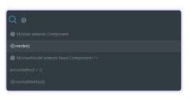

[][naomi]

[][watchers]
[][stars]
[][issues]
[][pulls]
[][forks]

[][naomi]
[][sublime]
[][naomi]
[][naomi]
[](#contributors)
[][package-control]

Enhanced syntax definitions for Sublime Text 3.

[][naomi]

## What’s included

### Color Schemes

* Candyman;

### Syntaxes

* CSS 3+;
* JavaScript;
  * [Stage 0-3 proposals](//github.com/tc39/proposals);
  * [Node globals](//nodejs.org/api/globals.html);
  * [Jest globals](//facebook.github.io/jest/docs/en/api.html);
  * [Flow](//flow.org);
  * [JSX](//reactjs.org/docs/introducing-jsx.html) with complete support for
    [Emmet](//github.com/sergeche/emmet-sublime);
* HTML 5+;
* MQL4 (Updating);
* Jest Snapshot;
* PHP 7+ (Updating);
* SCSS (Updating);

### Enhanced Go To Symbol

* **Windows or Linux**: `Ctrl+R`;
* **OSX**: `⌘ + R`;

[][naomi]

### OSX’s curly quotes for Windows and Linux

* `Alt+[` produces “.
* `Alt+Shift+[` produces ”.
* `Alt+]` produces ‘.
* `Alt+Shift+]` produces ’.

### Other enhancements

* JS/JSX comment toggle;
* Pressing enter between `()`, `[]`, `""`, `''` and ``` `` ```  will have the same
  behavior as `{}`;

## Installation

#### Manual installation

Clone the repository in your Sublime Text “Packages” directory:

    git clone https://github.com/borela/naomi.git Naomi

The “Packages” directory is located at:

* **OS X**: `~/Library/Application Support/Sublime Text 3/Packages`
* **Linux**: `~/.config/sublime-text-3/Packages`
* **Windows**: `%APPDATA%\Sublime Text 3\Packages`

#### Installing using Package Control

1. Install [Package Control](https://packagecontrol.io/installation).
2. Run **Package Control: Install Package** command.
3. Find and install the **Naomi** plugin.
4. Restart Sublime Text.

## Usage

After installing the plugin and restarting Sublime, it will automatically use
the syntaxes contained in this package.

You can also set them manually through:

  1. Go to the “View” menu;
  2. Then “Syntax”;
  3. Finally “Naomi”;

Or:

  1. Click at the bottom right corner where it shows the current syntax;
  2. Then “Naomi”.

## Contributors

Thanks goes to these wonderful people ([emoji legend][emoji-legend]):

<!-- ALL-CONTRIBUTORS-LIST:START -->
<!-- prettier-ignore -->
| [<br /><sub><b>Alexandre Borela</b></sub>](https://github.com/borela)<br />[🐛](https://github.com/borela/naomi/issues?q=author%3Aborela "Bug reports") [💻](https://github.com/borela/naomi/commits?author=borela "Code") [🎨](#design-borela "Design") [📖](https://github.com/borela/naomi/commits?author=borela "Documentation") | [<br /><sub><b>C.J. Winslow</b></sub>](http://cjwinslow.com)<br />[🐛](https://github.com/borela/naomi/issues?q=author%3AWhoaa512 "Bug reports") [💻](https://github.com/borela/naomi/commits?author=Whoaa512 "Code") [🤔](#ideas-Whoaa512 "Ideas, Planning, & Feedback") | [<br /><sub><b>faiwer</b></sub>](https://faiwer.ru)<br />[🐛](https://github.com/borela/naomi/issues?q=author%3Afaiwer "Bug reports") [🤔](#ideas-faiwer "Ideas, Planning, & Feedback") | [<br /><sub><b>Francisco Lourenço</b></sub>](https://www.betafabric.com/francisco/)<br />[🐛](https://github.com/borela/naomi/issues?q=author%3Afranciscolourenco "Bug reports") [💻](https://github.com/borela/naomi/commits?author=franciscolourenco "Code") | [<br /><sub><b>Tomas Barry</b></sub>](https://butternutbox.com/)<br />[💻](https://github.com/borela/naomi/commits?author=TomasBarry "Code") | [<br /><sub><b>crapthings</b></sub>](https://github.com/crapthings)<br />[🐛](https://github.com/borela/naomi/issues?q=author%3Acrapthings "Bug reports") | [<br /><sub><b>Max Mykhailenko</b></sub>](http://memcrab.com)<br />[🐛](https://github.com/borela/naomi/issues?q=author%3Amax-mykhailenko "Bug reports") |
| :---: | :---: | :---: | :---: | :---: | :---: | :---: |
| [<br /><sub><b>Marko Žarković</b></sub>](https://github.com/2Pacalypse-)<br />[🐛](https://github.com/borela/naomi/issues?q=author%3A2Pacalypse- "Bug reports") [🤔](#ideas-2Pacalypse- "Ideas, Planning, & Feedback") | [<br /><sub><b>James Wilson</b></sub>](http://neaumusic.github.io)<br />[🐛](https://github.com/borela/naomi/issues?q=author%3Aneaumusic "Bug reports") | [<br /><sub><b>ericbiewener</b></sub>](https://github.com/ericbiewener)<br />[🐛](https://github.com/borela/naomi/issues?q=author%3Aericbiewener "Bug reports") | [<br /><sub><b>Matt Le</b></sub>](https://lematt1991.github.io/)<br />[🐛](https://github.com/borela/naomi/issues?q=author%3Alematt1991 "Bug reports") | [<br /><sub><b>Clark Pan</b></sub>](https://github.com/clark-pan)<br />[🐛](https://github.com/borela/naomi/issues?q=author%3Aclark-pan "Bug reports") [🤔](#ideas-clark-pan "Ideas, Planning, & Feedback") | [<br /><sub><b>Nick K.</b></sub>](https://octetstream.me)<br />[🐛](https://github.com/borela/naomi/issues?q=author%3Aoctet-stream "Bug reports") | [<br /><sub><b>Alex Cavazos</b></sub>](https://eventa.mx)<br />[🐛](https://github.com/borela/naomi/issues?q=author%3AAlexKvazos "Bug reports") |
| [<br /><sub><b>Enrique Ballesté</b></sub>](https://divisionof.com)<br />[🐛](https://github.com/borela/naomi/issues?q=author%3Aeballeste "Bug reports") [🤔](#ideas-eballeste "Ideas, Planning, & Feedback") | [<br /><sub><b>David Calhoun</b></sub>](http://themaingate.net)<br />[🐛](https://github.com/borela/naomi/issues?q=author%3Adavidcalhoun "Bug reports") [🤔](#ideas-davidcalhoun "Ideas, Planning, & Feedback") | [<br /><sub><b>Strider</b></sub>](https://github.com/StreetStrider)<br />[🐛](https://github.com/borela/naomi/issues?q=author%3AStreetStrider "Bug reports") [🤔](#ideas-StreetStrider "Ideas, Planning, & Feedback") [💻](https://github.com/borela/naomi/commits?author=StreetStrider "Code") | [<br /><sub><b>Mauricio Andrades</b></sub>](http://mauricioandrades.com/)<br />[🐛](https://github.com/borela/naomi/issues?q=author%3AMauricioAndrades "Bug reports") | [<br /><sub><b>Gerard Roche</b></sub>](http://blog.gerardroche.com)<br />[💻](https://github.com/borela/naomi/commits?author=gerardroche "Code") | [<br /><sub><b>Ihor Oleksandrov</b></sub>](https://github.com/ihodev)<br />[💻](https://github.com/borela/naomi/commits?author=ihodev "Code") [🎨](#design-ihodev "Design") | [<br /><sub><b>Sean Miller</b></sub>](https://github.com/seanders)<br />[🐛](https://github.com/borela/naomi/issues?q=author%3Aseanders "Bug reports") |
| [<br /><sub><b>YuriGor</b></sub>](http://yurigor.com/)<br />[🐛](https://github.com/borela/naomi/issues?q=author%3AYuriGor "Bug reports") [🤔](#ideas-YuriGor "Ideas, Planning, & Feedback") |
<!-- ALL-CONTRIBUTORS-LIST:END -->

This project follows the [all-contributors][all-contributors] specification.
Contributions of any kind are welcome!

If you are not included but created bug reports, sent ideas or patches please
send a pull request to the `.all-contributorsrc` file.

[all-contributors]: //github.com/kentcdodds/all-contributors
[candyman]: schemes/candyman
[emoji-legend]: //github.com/kentcdodds/all-contributors#emoji-key
[forks]: //github.com/borela/naomi/network/members
[issues]: //github.com/borela/naomi/issues
[naomi]: //github.com/borela/naomi
[package-control]: //packagecontrol.io/packages/Naomi
[pulls]: //github.com/borela/naomi/pulls
[stars]: //github.com/borela/naomi/stargazers
[sublime]: //www.sublimetext.com
[sublimeLinter]: //github.com/SublimeLinter/SublimeLinter3
[watchers]: //github.com/borela/naomi/watchers
