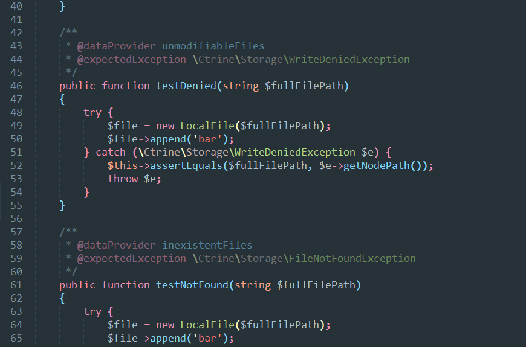

# Naomi

[][sublime]
[](LICENSE.md)

Package designed to provide easy to extend syntax highlighting and other stuff
that makes writting more fun.

## Features

#### General

* Auto complete asterisks in documentation blocks.
* Add Mac’s curly quotes shortcuts for Windows and Linux:
    1. Alt+[ produces “.
    2. Alt+Shift+[ produces ”.
    3. Alt+] produces ‘.
    4. Alt+Shift+] produces ’.

#### PHP 7

* Scopes for phpDoc instructions.
* Different scopes for decimal, floating point, binary, octal and hexadecimal
literal.
* Alternating scopes for namespace names.
* Alternating scopes for escaped characters.
* Alternating scopes for embedded variables.
* Alternating scopes for parenthesis in expressions.
* Different scopes for extended class and implemented interfaces.
* Different scopes for private and protected modifiers.

#### MQL4

* Different scopes for decimal, floating point and hexadecimal literal.
* Different scopes for RGB literal.
* Alternating scopes for escaped characters.

## Installation

#### Package Control

1. Install [Package Control](https://packagecontrol.io/installation).
2. Run **Package Control: Install Package** command.
3. Find and install the **Naomi** plugin.
4. Restart Sublime Text if there are issues.

#### Manual

Clone the repository in your Sublime Text “Packages” directory:

    git clone https://github.com/borela/naomi.git Naomi

The “Packages” directory is located at:

* **OS X**: `~/Library/Application Support/Sublime Text 3/Packages`
* **Linux**: `~/.config/sublime-text-3/Packages`
* **Windows**: `%APPDATA%\Sublime Text 3\Packages`

## Configuration

It is recommended that you disable the default PHP package to prevent conflicts
with the auto completition:

1. Go to `Preferences / Settings - User`.
2. Add it to the ignored packages:

```json
"ignored_packages": [
    "PHP"
]
```

## Usage

1. Go to the menu `View / Syntax / Naomi / ...` to select the new syntax.
2. Select a color scheme provided in `Preferences / Color Scheme / Naomi`.

**Note:** You aren’t required to use the color schemes provided but keep in mind
that not all features listed before are going to work with other color schemes.

## Preview




[sublime]: http://www.sublimetext.com/
