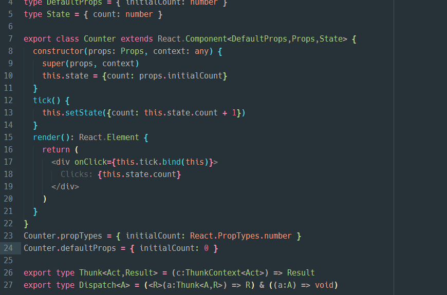
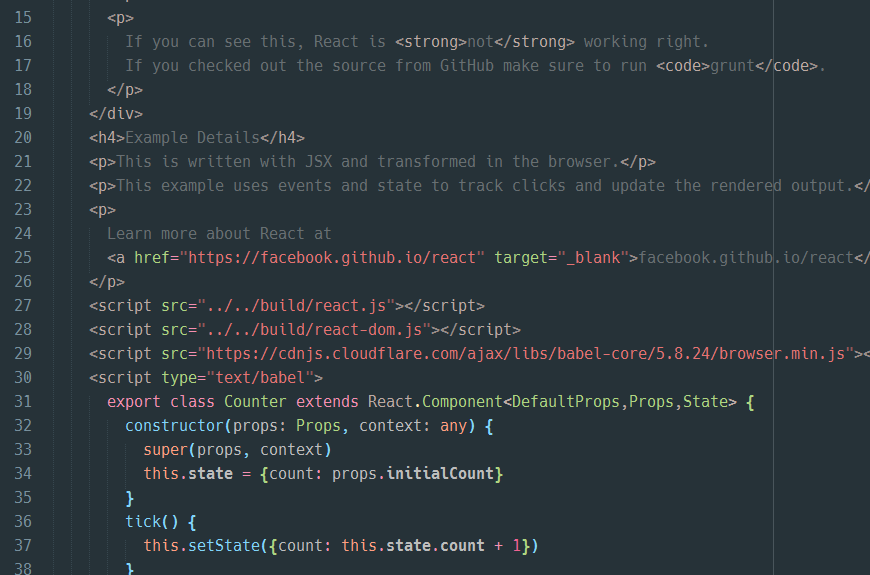
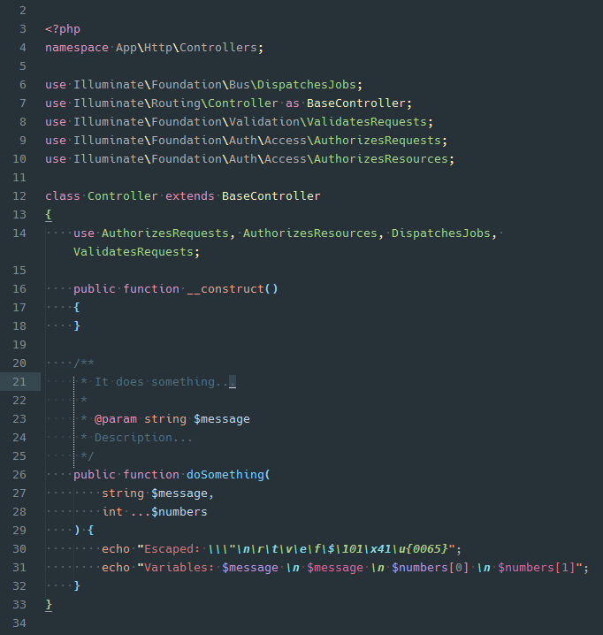

# Naomi

[][sublime]

Package designed to provide easy to extend syntax highlighting and other stuff
that makes writting more fun.

#### Constants vs Variables

Sublime highlighting system is amazing, it uses only regular expressions and do
a ton of optimizations on them which makes it very fast. That alone made me stop
using IDEs that scans the project to perform the highlighting as I value
responsiveness in a editor.

But, it’s not without trade offs, in some languages is not possible to differentiate
constants from variables just using regular expressions. The solution then is that
you must have a coding style where all your constants are uppercase and it’ll
highlight them fine.

## Installation

#### Package Control

1. Install [Package Control](https://packagecontrol.io/installation).
2. Run **Package Control: Install Package** command.
3. Find and install the **Naomi** plugin.
4. Restart Sublime Text if there are issues.

#### Manual

Clone the repository in your Sublime Text “Packages” directory:

    git clone https://github.com/borela/naomi.git Naomi

The “Packages” directory is located at:

* **OS X**: `~/Library/Application Support/Sublime Text 3/Packages`
* **Linux**: `~/.config/sublime-text-3/Packages`
* **Windows**: `%APPDATA%\Sublime Text 3\Packages`

## Usage

1. Go to the menu `View / Syntax / Naomi / ...` to select the new syntax.
2. Select a color scheme provided in `Preferences / Color Scheme / Naomi`.

#### Notes

You aren’t required to use the color schemes provided but keep in mind
that not all features listed are going to work with other ones. Also, be aware
of auto completion conflicts provided by other packages, you may need to disable
them.

## Features

#### General

* Auto complete asterisks in documentation blocks.
* Add Mac’s curly quotes shortcuts for Windows and Linux:
  1. Alt+[ produces “.
  2. Alt+Shift+[ produces ”.
  3. Alt+] produces ‘.
  4. Alt+Shift+] produces ’.

#### FJSX15

Combines ES2015+, Flow, React’s JSX.

* Templates.
* Interfaces.
* Classes.
* Get and set class methods.
* Static variables and functions.
* Simple functions.
* Generator functions.
* Arrow functions.
* Decorators.
* Destructuring operators.
* Alternating parenthesis in expressions.
* Alternating escaped characters.
* Decimal, floating point and hexadecimal literals.

#### JSON

* Keys up to 7 levels.
* Constants.
* Decimal, floating point and hexadecimal literals.

#### HTML 5

* Balanced tags.
* FJSX15 inside script tags.
* CSS3 inside style tags.
* Section root elements.
* Section elements.
* Embedded elements.
* Form elements.

#### SCSS3

* Ids.
* Classes.
* Tags.
* Pseudo classes.
* Pseudo elements.
* Keyframes.
* Conditionals.
* Loops.
* Mixins.
* Functions.
* Function calls.

#### MQL4

* Templates.
* Classes.
* Functions.
* Function calls.
* Datetime literals.
* RGB literals.
* Alternating parenthesis in expressions.
* Alternating escaped characters.
* Decimal, floating point and hexadecimal literals.

#### PHP 7

* phpDoc instructions.
* Alternating namespace names.
* Alternating escaped characters.
* Alternating embedded variables.
* Alternating parenthesis in expressions.
* Classes.
* Interfaces.
* Functions.
* Function calls.
* Private and protected modifiers.
* Decimal, floating point, binary, octal and hexadecimal literals.

#### XML 1.0

* Balanced tags.
* Attributes.

## Preview

#### FJSX15 (ES2015 + FlowType + React’s JSX)

#### HTML 5

#### PHP 7

[sublime]: http://www.sublimetext.com/
