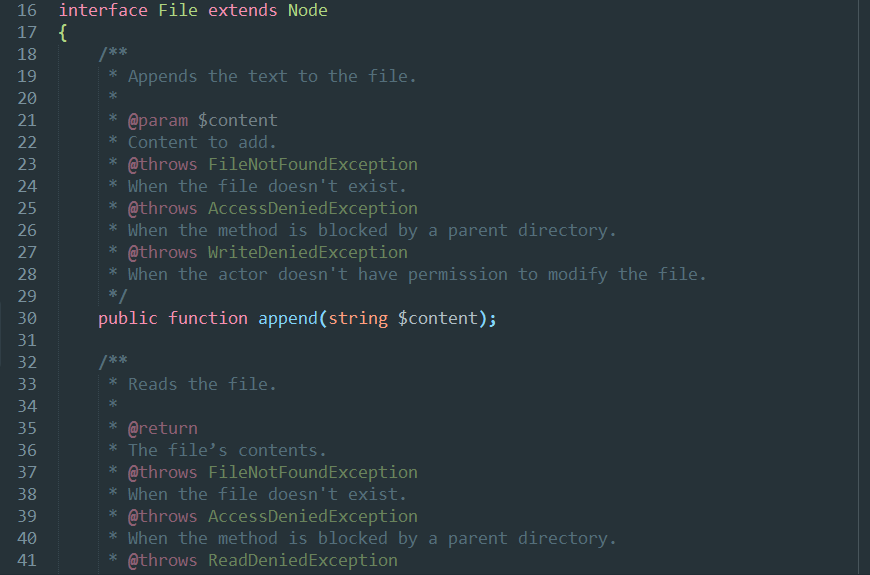

# Naomi

Package designed to provide easy to extend syntax highlighting. Color schemes
are provided not only to test the highlighting and show the new features, but to
serve as a template to create new ones.

## Features

#### PHP 7

* Scopes for phpDoc instructions.
* Different scopes for decimal, floating point, binary, octal and hexadecimal
literal.
* Alternating scopes for namespace names.
* Alternating scopes for escaped characters.
* Alternating scopes for embedded variables.
* Different scopes for extended class and implemented interfaces.
* Different scopes for private and protected modifiers.

## Installation

#### Package Control

1. Install [Package Control](https://packagecontrol.io/installation).
2. Run **Package Control: Install Package** command.
3. Find and install the **Naomi** plugin.
4. Restart Sublime Text if there are issues.

#### Manual

Clone the repository in your Sublime Text “Packages” directory:

    git clone https://github.com/borela/naomi.git Naomi

The “Packages” directory is located at:

* **OS X**: `~/Library/Application Support/Sublime Text 3/Packages`
* **Linux**: `~/.config/sublime-text-3/Packages`
* **Windows**: `%APPDATA%\Sublime Text 3\Packages`

## Usage

1. Go to the menu `View / Syntax / PHP 7` to select the new syntax.
2. Select a color scheme provided in `Preferences / Color Scheme / Naomi`.

Note: You aren't required to use the color schemes provided but keep in mind
that not all features listed before are going to work with other color schemes.

## Contributing

Thank you for considering contributing to this project! See: [CONTRIBUTING](CONTRIBUTING.md).

## License

Unless explicity stated all files are licensed under the [Apache 2.0 license](LICENSE.md).

## Preview

